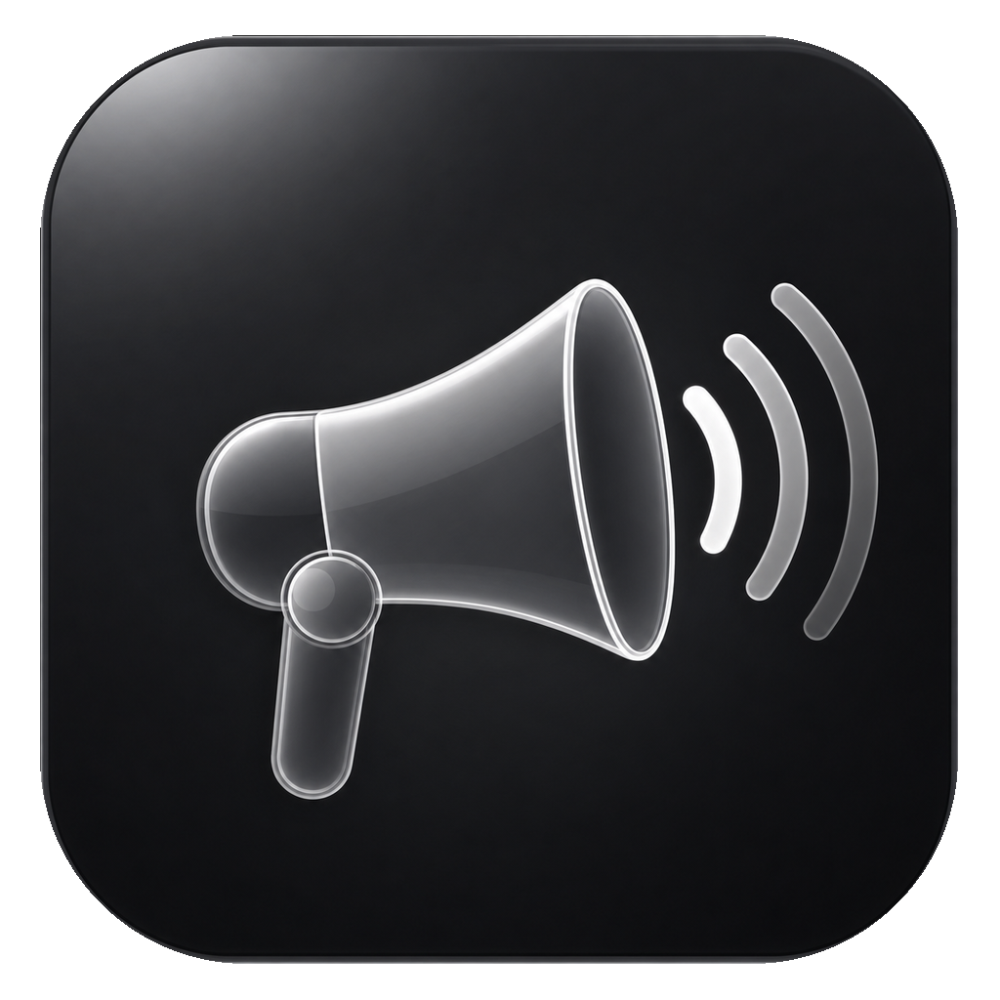

<p align="center">
  
</p>

<h1 align="center">Megaphone</h1>

<p align="center">
  Free, open-source dictation for macOS that runs <b>entirely on your Mac</b>,<br>
  powered by Apple's new SpeechAnalyzer engine.
</p>

<p align="center">
  <a href="https://github.com/Kuberwastaken/megaphone/releases/latest/download/Megaphone.dmg"><b>⬇ Download Megaphone.dmg</b></a><br>
  <sub>Requires macOS 26 (Tahoe) on Apple silicon</sub>
</p>

---

Hold `Fn`, talk, let go — clean text lands in whatever app you're typing in. No subscription, no server, and your voice never leaves your machine to be transcribed.

## Why I built this

I was scrolling Hacker News and hit [Inscribe's benchmark of Apple's new Speech APIs](https://get-inscribe.com/blog/apple-speech-api-benchmark.html). The numbers were kind of absurd: on 5,559 LibriSpeech utterances, Apple's new **SpeechAnalyzer** hit a **2.12% word error rate** — beating Whisper Small (3.74%), Whisper Base (5.42%), and demolishing Apple's own legacy `SFSpeechRecognizer` (9.02%) — while running **~3× faster than Whisper Small**, fully on-device.

A state-of-the-art speech model, shipped free inside macOS… and almost nothing was actually using it. Dictation apps were still charging monthly subscriptions to ship your audio to cloud Whisper endpoints.

So Megaphone exists to fix that. It's a fork of the excellent [FreeFlow](https://github.com/zachlatta/freeflow) with the entire cloud transcription stack ripped out and rebuilt around SpeechAnalyzer.

## Features

- **100% on-device transcription** — audio is analyzed by Apple's speech model on your Mac. No transcription API, no key, no network, works on a plane.
- **Instant results** — audio streams into the analyzer *while you speak*, so the transcript is essentially finished the moment you stop talking.
- **Hold-to-talk or toggle** — hold `Fn` to dictate, or tap `Command-Fn` to start/stop. Both shortcuts are customizable.
- **Context-aware cleanup** — an optional LLM pass (Groq free tier or any OpenAI-compatible provider, including local models) fixes grammar, removes filler words, and spells names correctly using nearby app context.
- **Edit Mode** — select text, speak an instruction ("make this shorter", "turn this into bullets"), get the transformed text back.
- **Custom vocabulary** — your names and jargon bias the on-device speech model directly *and* guide the cleanup pass.
- **Multilingual** — pick any language the on-device model supports, with per-language model downloads managed in Settings.
- **Configurable everything** — feedback sounds, overlay, clipboard behavior, voice macros, custom prompts.

## The engine: SpeechAnalyzer

SpeechAnalyzer is Apple's next-generation speech-to-text API, introduced with macOS 26 / iOS 26. It's the same technology behind system dictation and it is genuinely great:

| Engine | WER (clean) | WER (noisy) |
|---|---|---|
| **Apple SpeechAnalyzer** | **2.12%** | **4.56%** |
| Whisper Small | 3.74% | 7.95% |
| Whisper Base | 5.42% | 12.51% |
| Apple SFSpeechRecognizer (legacy) | 9.02% | 16.25% |

<sub>Word error rate on LibriSpeech, measured by [Inscribe](https://get-inscribe.com/blog/apple-speech-api-benchmark.html) on an M2 Pro — lower is better.</sub>

What makes it special beyond the accuracy:

- **It's fast.** Analysis runs far faster than realtime on Apple silicon (~3× Whisper Small's speed), so even long recordings finish in moments — and Megaphone streams audio in during recording, so there's nothing left to wait for.
- **It's private by construction.** The model runs on the Neural Engine; nothing is uploaded, ever.
- **It's free.** No per-minute API pricing — the model ships with the OS and is downloaded once per language.
- **It's a real API.** A modern async-Swift interface (`SpeechAnalyzer` + `SpeechTranscriber` modules) with streaming input, volatile/final results, contextual-string biasing (that's how custom vocabulary works), and automatic model asset management.

Megaphone is, as far as I know, one of the first dictation apps built *entirely* on it.

## Quick start

1. [Download Megaphone.dmg](https://github.com/Kuberwastaken/megaphone/releases/latest/download/Megaphone.dmg) and drag it into Applications
2. Follow setup — grant microphone + accessibility, and optionally add a free [Groq](https://groq.com/) API key (used **only** for the AI cleanup and app-context steps; transcription never touches it)
3. Hold `Fn` and talk — the on-device speech model downloads automatically the first time

## Privacy

There is no Megaphone server and transcription happens entirely on your Mac — recorded audio never leaves your computer. If you enable AI cleanup, the only things that leave are the *text* transcript and app-context calls to the LLM provider you configured. Point it at a local model (Ollama, LM Studio, any OpenAI-compatible server) and even that stays home.

## Building from source

```bash
git clone https://github.com/Kuberwastaken/megaphone
cd megaphone
make        # requires Xcode 26 (macOS 26 SDK)
make run
```

## Credits

Megaphone stands on the shoulders of [**FreeFlow**](https://github.com/zachlatta/freeflow) — huge thanks to [**Zach Latta**](https://github.com/zachlatta), [@marcbodea](https://github.com/marcbodea), and all the FreeFlow contributors for building such an amazing app: the dictation UX, shortcut system, context-aware cleanup, and Edit Mode all come from their work. If you want a cloud-provider-based dictation app that runs on older Macs and Intel, go use FreeFlow — it's excellent.

Inspiration credit to [Inscribe's Apple Speech API benchmark](https://get-inscribe.com/blog/apple-speech-api-benchmark.html) for showing everyone what this model can do.

## License

MIT — see [LICENSE](LICENSE).

---

<p align="center">
  Made with &lt;3 and sleep deprivation by <a href="https://kuber.studio"><b>Kuber Mehta</b></a>
</p>
