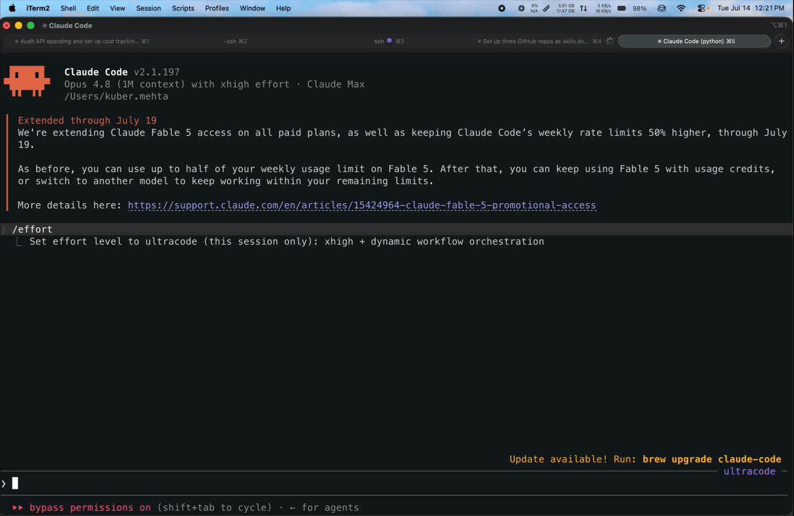

<p align="center">
  
</p>

<h1 align="center">Megaphone</h1>

<p align="center">
  A free, open-source dictation app for macOS that runs <b>entirely on your Mac</b>,<br>
  powered by Apple's new SpeechAnalyzer engine.
</p>

<p align="center">
  <a href="https://github.com/Kuberwastaken/megaphone/releases/latest/download/Megaphone.dmg"><b>⬇ Download Megaphone.dmg</b></a><br>
  <sub>Requires macOS 26 (Tahoe) on Apple silicon</sub>
</p>

---

<p align="center">
  
</p>

<div align="center">

Hold `Fn`, speak, and let go. Megaphone types the result into whatever app you're using.

</div>

---

## One-line install

```bash
curl -L -o /tmp/Megaphone.dmg https://github.com/Kuberwastaken/megaphone/releases/latest/download/Megaphone.dmg && xattr -c /tmp/Megaphone.dmg && hdiutil attach /tmp/Megaphone.dmg -nobrowse -mountpoint /tmp/megaphone-dmg -quiet && rm -rf /Applications/Megaphone.app && ditto /tmp/megaphone-dmg/Megaphone.app /Applications/Megaphone.app && hdiutil detach /tmp/megaphone-dmg -quiet && rm /tmp/Megaphone.dmg && open /Applications/Megaphone.app
```

Downloads the latest release, clears the [quarantine flag](#installing-manual), installs to /Applications, and launches — all in one paste:


## Why I built this

I came across [Inscribe's benchmark of Apple's new Speech APIs](https://get-inscribe.com/blog/apple-speech-api-benchmark.html) while scrolling Hacker News yesterday, and the results caught me off guard.

Across 5,559 LibriSpeech utterances, Apple's new **SpeechAnalyzer** reached a **2.12% word error rate**. That beat Whisper Small at 3.74%, Whisper Base at 5.42%, and Apple's older `SFSpeechRecognizer` at 9.02%. It also ran roughly **three times faster than Whisper Small**, completely on-device.

Apple had quietly shipped a genuinely excellent speech model as part of macOS, but very few apps seemed to be using it. Meanwhile, many dictation apps were still charging monthly subscriptions to send recordings to cloud-hosted Whisper APIs.

That felt a little silly, so I built Megaphone.

Megaphone is a fork of the excellent [FreeFlow](https://github.com/zachlatta/freeflow). I removed its cloud transcription stack and rebuilt that part of the app around Apple's SpeechAnalyzer.

## Installing-Manual

1. [Download Latest Megaphone.dmg](https://github.com/Kuberwastaken/megaphone/releases/latest/download/Megaphone.dmg).
2. Read the section below, because macOS is about to call this app malware.
3. Open the DMG and drag Megaphone into your Applications folder.
4. Launch it, walk through setup, and grant the microphone and accessibility permissions.
5. Hold `Fn` and start talking. Apple's speech model for your language downloads automatically the first time you use it.

Getting macOS to *not* scream about an app requires notarization, and notarization requires a $99/year Apple Developer membership. Sooo

**Option 1 — one command.** Clear the quarantine flag before opening the DMG:

```bash
xattr -d com.apple.quarantine ~/Downloads/Megaphone.dmg
```

**Option 2 — clicking things.** Open the app once, dismiss the warning, then go to System Settings → Privacy & Security, scroll down, and hit **Open Anyway**.

**Option 3 — trust no one.** [Build it from source](#building-from-source). Locally built apps skip the warning entirely.

Releases *are* signed with a persistent certificate, so macOS permissions you grant survive updates

## Features

* **Fully on-device transcription** — Apple's speech model processes your audio directly on your Mac. There is no transcription API, API key, or internet connection required.
* **Results as soon as you stop speaking** — Megaphone streams audio into the analyzer while you're talking, so most of the work is already done by the time you release the shortcut.
* **Hold-to-talk or toggle mode** — hold `Fn` to dictate, or press `Command-Fn` to start and stop recording. Both shortcuts can be changed.
* **Custom vocabulary** — add names, technical terms, and other jargon. Megaphone uses them to steer Apple's speech model toward your words.
* **Multiple languages** — choose any language supported by Apple's on-device model. Megaphone handles the required model downloads from Settings.
* **Plenty of settings** — configure shortcuts, sounds, the recording overlay, clipboard behaviour, voice macros, prompts, and more.

## The transcription engine

SpeechAnalyzer is Apple's new speech-to-text API, introduced with macOS 26 and iOS 26. It appears to use the same underlying technology as Apple's system dictation, and it performs remarkably well.

| Engine                            | WER (clean) | WER (noisy) |
| --------------------------------- | ----------: | ----------: |
| **Apple SpeechAnalyzer**          |   **2.12%** |   **4.56%** |
| Whisper Small                     |       3.74% |       7.95% |
| Whisper Base                      |       5.42% |      12.51% |
| Apple SFSpeechRecognizer (legacy) |       9.02% |      16.25% |

<sub>Word error rate on LibriSpeech, measured by [Inscribe](https://get-inscribe.com/blog/apple-speech-api-benchmark.html) on an M2 Pro. Lower is better.</sub>

The accuracy is only part of what makes it useful:

* **It's fast.** SpeechAnalyzer runs much faster than real time on Apple silicon—around three times faster than Whisper Small in Inscribe's testing. Because Megaphone processes audio while you're speaking, there is usually very little left to do afterwards.
* **It's private by default.** Transcription runs on-device. Your recordings are not uploaded to a server.
* **It's free to use.** There is no per-minute API bill. Apple provides the model with the operating system, and each language only needs to be downloaded once.
* **It's a proper native API.** Apple provides an async Swift interface through `SpeechAnalyzer` and `SpeechTranscriber`, including streaming input, partial and final results, contextual vocabulary hints, and automatic model asset management.

As far as I know, Megaphone is one of the first general-purpose dictation apps built entirely around it.

## Privacy

Megaphone does not have a server.

Transcription happens entirely on your Mac, and recorded audio never leaves your computer.

That's the whole story — as of 1.0.3 there is no cloud configuration in the app at all. (FreeFlow's LLM cleanup layer is still in the codebase, dormant, waiting on a possible port to Apple's on-device Foundation Models.)

## Building from source

```bash
git clone https://github.com/Kuberwastaken/megaphone
cd megaphone
make        # requires Xcode 26 and the macOS 26 SDK
make run
```

## Credits

Megaphone is built on top of [**FreeFlow**](https://github.com/zachlatta/freeflow).

A huge thank you to [**Zach Latta**](https://github.com/zachlatta), [@marcbodea](https://github.com/marcbodea), and everyone who has contributed to FreeFlow. The dictation interface, shortcut system, context-aware cleanup, and Edit Mode all started with their work.

If you need a cloud-provider-based dictation app that supports older versions of macOS or Intel Macs, use FreeFlow. It's excellent.

Thanks as well to [Inscribe](https://get-inscribe.com/blog/apple-speech-api-benchmark.html) for publishing the benchmark that made me realise how good Apple's new speech model was.

## License

MIT — see [LICENSE](LICENSE).

---

<p align="center">
  Made with &lt;3 and an irresponsible amount of lost sleep by <a href="https://kuber.studio"><b>Kuber Mehta</b></a>
</p>
